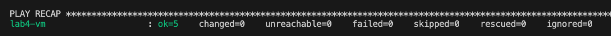
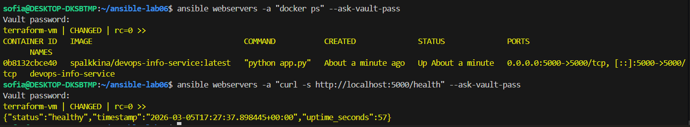
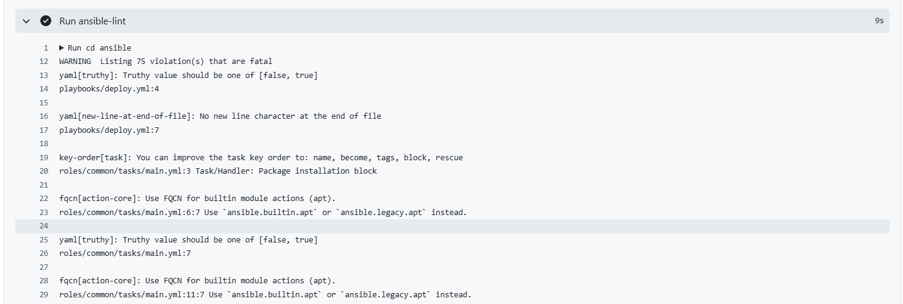
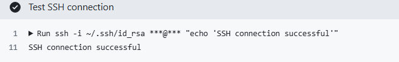
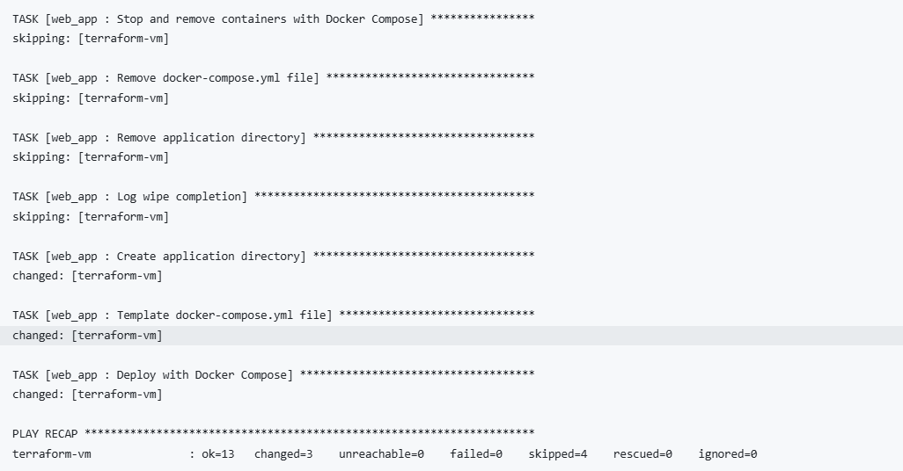
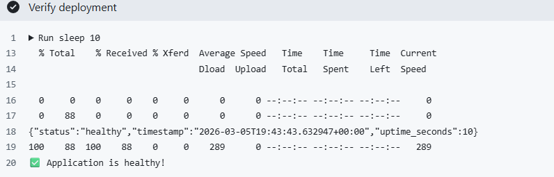

# Lab 6: Advanced Ansible & CI/CD - Submission

**Name:** Sofia Palkina  
**Date:** 2026-03-05  

## Task 1: Blocks & Tags 


### Tag Strategy

**Available tags:**
- `common` - entire common role
- `packages` - package installation tasks
- `config` - system configuration tasks
- `docker` - entire docker role
- `docker_install` - Docker installation only
- `docker_config` - Docker configuration only

### Testing Results

**List all tags:**

```bash
ansible-playbook playbooks/provision.yml --list-tags --ask-vault-pass
```


**Selective execution with `--tags "packages"`:**


**Result:** Only package installation tasks executed.

**Selective execution with `--tags "docker_install"`:**


**Result:** Only Docker installation tasks executed, configuration skipped.

**Idempotency check:**

First run: `changed=2`  
Second run: `changed=0` ✅



### Research Questions

**Q: What happens if rescue block also fails?**  
A: Ansible marks the task as failed and stops playbook execution (unless `ignore_errors: yes` is set). The `always` block still executes.

**Q: Can you have nested blocks?**  
A: Yes, blocks can be nested inside other blocks for more complex error handling logic.

**Q: How do tags inherit to tasks within blocks?**  
A: Tags applied to a block automatically apply to all tasks within that block, but tasks can also have their own additional tags.

---

## Task 2: Docker Compose 

###  Role Rename

**Action taken:**
```bash
mv roles/app_deploy roles/web_app
```

**Updated references in:**
- `playbooks/deploy.yml`
- All documentation

###  Docker Compose Template

**File:** `roles/web_app/templates/docker-compose.yml.j2`

```yaml
services:
  {{ app_name }}:
    image: {{ docker_image }}:{{ docker_image_tag }}
    container_name: {{ app_name }}
    ports:
      - "{{ app_port }}:{{ app_internal_port }}"
    environment:
      - APP_NAME={{ app_name }}
      - ENVIRONMENT=production
    restart: {{ restart_policy }}
    networks:
      - app_network

networks:
  app_network:
    driver: bridge
```

### Role Dependencies

**File:** `roles/web_app/meta/main.yml`

```yaml
---
dependencies:
  - role: docker
    tags:
      - docker
```

###  Deployment Results

**First deployment:**


**Verification and Health check:**

```bash
ansible webservers -a "docker ps" --ask-vault-pass
ansible webservers -a "curl -s http://localhost:5000/health" --ask-vault-pass
```

**Output:**



###  Idempotency Verification

**Second deployment run:**


**Result:** Idempotent - no unnecessary changes on repeated execution.

###  Research Questions

**Q: What's the difference between `restart: always` and `restart: unless-stopped`?**  
A: `always` restarts container even after Docker daemon restarts. `unless-stopped` doesn't restart if container was manually stopped.

**Q: How do Docker Compose networks differ from Docker bridge networks?**  
A: Compose creates isolated networks per project with automatic DNS resolution by service name. Bridge networks are shared across all containers.

**Q: Can you reference Ansible Vault variables in the template?**  
A: Yes, Vault variables are decrypted before templating, so they can be used in Jinja2 templates.


## Task 3: Wipe Logic 

### Testing Scenarios

#### Scenario 1: Normal Deployment (wipe skipped)

**Command:**
```bash
ansible-playbook playbooks/deploy.yml --ask-vault-pass
```

**Result:**
- ✅ Wipe tasks skipped
- ✅ Application deployed
- ✅ Container running


#### Scenario 2: Wipe Only

**Command:**
```bash
ansible-playbook playbooks/deploy.yml \
  -e "web_app_wipe=true" \
  --tags web_app_wipe \
  --ask-vault-pass
```

**Result:**
- ✅ Wipe tasks executed
- ✅ Deployment tasks skipped
- ✅ Container removed
- ✅ Directory deleted


#### Scenario 3: Clean Reinstall (wipe → deploy)

**Command:**
```bash
ansible-playbook playbooks/deploy.yml \
  -e "web_app_wipe=true" \
  --ask-vault-pass
```

**Result:**
- ✅ Wipe tasks executed (old removed)
- ✅ Deployment tasks executed (new installed)
- ✅ Fresh container running


#### Scenario 4: Safety Check (tag without variable)

**Command 4a:**
```bash
ansible-playbook playbooks/deploy.yml \
  --tags web_app_wipe \
  --ask-vault-pass
```

**Result:**
- ✅ Wipe tasks skipped (`when` condition blocks)
- ✅ Application NOT removed
- ✅ Double-gating protection works!


**Command 4b:**
```bash
ansible-playbook playbooks/deploy.yml \
  -e "web_app_wipe=true" \
  --tags web_app_wipe
```


### Research Questions

**Q: Why use both variable AND tag?**  
A: Double protection against accidental deletion. Tag allows wipe-only execution without deployment, variable requires explicit confirmation.

**Q: What's the difference between `never` tag and this approach?**  
A: `never` tag requires explicit tag specification to run. Our approach adds additional variable check for extra safety.

**Q: Why must wipe logic come BEFORE deployment in main.yml?**  
A: To support clean reinstallation scenario where we wipe old installation and deploy fresh in single playbook run.

**Q: When would you want clean reinstallation vs. rolling update?**  
A: Clean reinstall for testing or state corruption issues. Rolling update for production with zero downtime.

**Q: How would you extend this to wipe Docker images and volumes too?**  
A: Add tasks with `docker_image` module (state: absent) and `docker_volume` module to remove associated volumes.

## Task 4: CI/CD 

### GitHub Secrets Configuration

**Configured secrets:**
- `ANSIBLE_VAULT_PASSWORD` - Vault decryption password
- `SSH_PRIVATE_KEY` - SSH private key for VM access
- `VM_HOST` - `89.169.158.252`
- `VM_USER` - `ubuntu`

### Workflow Results

**Status Badge:**

[](https://github.com/angel-palkina/DevOps-Core-Course/actions/workflows/ansible-deploy.yml)

**Successful workflow run:**


**Lint job output:**



**Deploy job output:**




**Verification output:**



### Research Questions

**Q: What are the security implications of storing SSH keys in GitHub Secrets?**  
A: GitHub Secrets are encrypted at rest and only exposed during workflow runs. Risks include GitHub account compromise. Mitigations: use 2FA, limit SSH key permissions, regular key rotation.

**Q: How would you implement a staging → production deployment pipeline?**  
A: Create separate workflows for staging and production with different triggers (staging on push, production on release/tag). Use GitHub Environments with approval gates.

**Q: What would you add to make rollbacks possible?**  
A: Tag Docker images with Git commit SHA, store image tags in Git, create rollback workflow accepting version parameter, use wipe logic before deploying previous version.

**Q: How does self-hosted runner improve security compared to GitHub-hosted?**  
A: Direct infrastructure access (no SSH needed), controlled environment, secrets never leave infrastructure, faster for large files, compliance requirements.

### Challenges & Solutions

**Challenge:** Health check failing due to incorrect port mapping  
**Solution:** Fixed port mapping from `5000:6000` to `5000:5000` to match application configuration


