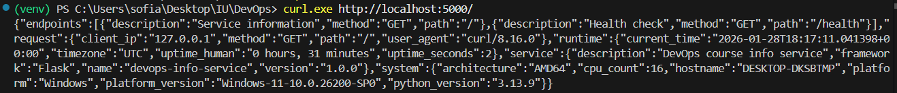
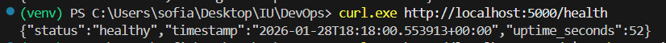
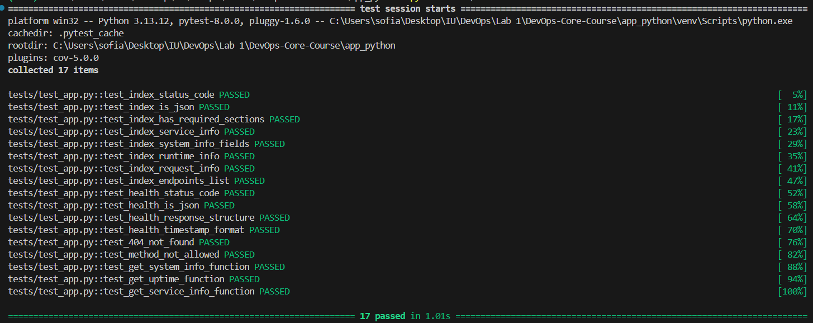
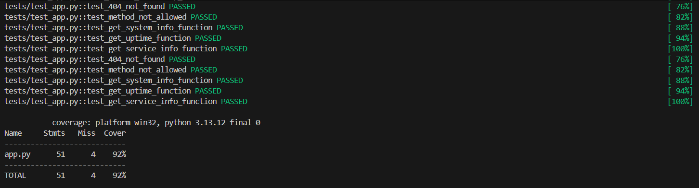

# DevOps Info Service

## Overview
A web application that provides detailed information about itself and its runtime environment. This service will evolve throughout the DevOps course into a comprehensive monitoring tool.

## Project Structure
```text
app_python/
├── app.py                    # Main application
├── requirements.txt          # Dependencies
├── requirements-dev.txt      # Development dependencies (testing, linting)
├── .gitignore               
├── README.md                # This file
├── tests/                   
│   ├── __init__.py
│   └── test_app.py          
└── docs/                    # Documentation
    ├── LAB01.md
    ├── LAB02.md
    ├── LAB03.md
    ├── ...
    └── screenshots/
```

## Prerequisites
- Python 3.11 or higher
- pip (Python package manager)

## Installation

1. Clone the repository:
    ```bash
    git clone <repository-url>
    cd app_python
    ```


2. Create a virtual environment:

    ```bash
    python -m venv venv
    ```

3. Activate the virtual environment:
- Linux/Mac:

    ```bash
    source venv/bin/activate
    ```
- Windows:

    ```bash
    venv\Scripts\activate
    ```

4. Install dependencies:

    ```bash
    pip install -r requirements.txt

    # or for testing 
    pip install -r requirements-dev.txt
    ```

## Running the Application

```bash
python app.py #Default Configuration The service will start at: http://0.0.0.0:5000

# Custom Configuration on Linux/Mac:
PORT=8080 python app.py # Change port
HOST=127.0.0.1 PORT=3000 python app.py # Change host and port
DEBUG=true python app.py # Enable debug mode

# Custom Configuration on  Windows PowerShell:
$env:HOST="127.0.0.1"; $env:PORT=8080; python app.py
```

## API Endpoints

### GET /

- Returns comprehensive service and system information (endpoints, request, runtime, system info, service info).

    **Request:**

    ```bash
    curl http://localhost:5000/
    ```

    **Status Codes:**

    - 200 OK: Service is healthy
    - 4xx: Service is unhealthy (implemented in future labs)
    - 5xx: Service is unhealthy (implemented in future labs)

    **Response Example:**
    

### GET /health

- Health check endpoint for monitoring systems and Kubernetes probes.

    **Request:**

    ```bash
    curl http://localhost:5000/health
    ```

    **Status Codes:**

    - 200 OK: Service is healthy
    - 4xx: Service is unhealthy (implemented in future labs)
    - 5xx: Service is unhealthy (implemented in future labs)

    **Response Example:**
    

##  Configuration

The application is configured through environment variables:

|Variable | Default | Description |
|----------|-------|---------|
|HOST | 0.0.0.0 | Host interface to bind the server|
|PORT | 5000 | Port number to listen on|
|DEBUG | false | Debug mode (true/false)|

## Testing

This project uses pytest for unit testing. Pytest was chosen for its:

- Simple, Pythonic syntax

- Powerful fixture system

- Excellent plugin ecosystem (coverage, mocking)

- Clear assertion reporting

### What's Tested

1) `GET /`	

    ✓ Status code 200

    ✓ JSON response format

    ✓ All required sections present

    ✓ Data types validation

    ✓ Service info correctness

2) `GET /health`	

    ✓ Status code 200

    ✓ Status = "healthy"

    ✓ Timestamp format (ISO 8601)

    ✓ Uptime tracking
3) Error Handling	

    ✓ 404 Not Found response

    ✓ JSON error format

    ✓ Method not allowed

### Running Tests Locally

```bash 
# Run all tests
pytest tests/ -v

# Run tests with coverage report
pytest tests/ --cov=app --cov-report=term

# Run tests with HTML coverage report
pytest tests/ --cov=app --cov-report=html
# Then open htmlcov/index.html in your browser

# Run specific test file
pytest tests/test_app.py -v

# Run tests matching a name pattern
pytest tests/ -k "health" -v

```

### Expected Output



### Test Coverage
Current test coverage: ~92%


### CI/CD Status


## Docker

This application is containerized using Docker for consistent and portable deployment.

- Build the image locally

    ```sh
    docker build -t spalkkina/devops-info-service:1.0 .
    ```
- Run the container locally
    ```
    docker run -p 5000:5000 spalkkina/devops-info-service:1.0
    ```
    The app will be accessible at http://localhost:5000.
- Pull from Docker Hub
    ```
    docker pull spalkkina/devops-info-service:1.0
    docker run -p 5000:5000 spalkkina/devops-info-service:1.0
    ```
- You can run specific versions by adjusting the tag
    ```
    docker run -p 5000:5000 spalkkina/devops-info-service:latest
    docker run -p 5000:5000 spalkkina/devops-info-service:1.0   
    ```
## Future Development

This service will evolve throughout the course:

- Lab 8: Metrics endpoint for Prometheus

- Lab 9: Kubernetes deployment

- Lab 12: Persistence with file storage

- Lab 13: Multi-environment deployment


