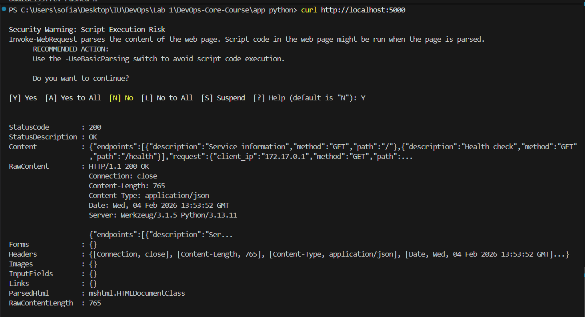

# Lab 2 — Docker Containerization Report

##  Docker Best Practices Applied

- **Non-root user:**  
  `RUN useradd -m appuser` and `USER appuser` are used to avoid running the app as root, which improves security by following the principle of least privilege.This prevents container breakout attacks where an attacker could gain root access to the host system if a vulnerability is exploited

- **Specific base image version:**  
  `FROM python:3.13-slim` ensures reproducibility and reduces image size by using a minimal Python image. Smaller attack surface, faster download/startup times, reduced storage costs.
  ```
    python:3.13-full: ~900MB
    python:3.13-slim: ~195MB (79% reduction)
  ```

- **Minimal context and .dockerignore:**  
  The `.dockerignore` file excludes files unnecessary for the container (e.g., `.git/`, `__pycache__/`, `tests/`). This reduces build time and image size.  Excluding ``.git/`` prevents source code history, API keys, or secrets from accidentally being baked into the image.

- **Layer ordering for caching:**  
  `COPY requirements.txt .` and `RUN pip install ...` are placed before `COPY . .` so Docker caches dependencies installation if only the source code changes.  In automated pipelines, proper layer caching can reduce build times from minutes to seconds, saving computational resources and speeding up deployments.

- **Only necessary files are copied:**  
  The Dockerfile copies only files required to run the application. Smaller images transfer faster over networks — crucial for scaling across multiple nodes in production.

- **`WORKDIR` instruction:** Setting `/app` as working directory improves organization. Ensures all subsequent commands (`COPY`, `RUN`, `CMD`) execute from /app rather than relying on relative paths which can break.

- **No-cache pip install:** `--no-cache-dir` flag reduces image size by not storing pip cache. Pip's cache (typically 50-100MB) contains downloaded package wheels for faster reinstalls. This cache is useless in a production container but adds significant bloat.

- **`EXPOSE` instruction:** Documents the port the application listens on (5000). Tools like Docker Compose and Kubernetes read `EXPOSE` to configure networking automatically.

### Relevant Dockerfile snippets

```dockerfile
FROM python:3.13-slim

WORKDIR /app
COPY requirements.txt .
RUN pip install --no-cache-dir -r requirements.txt
COPY . .
RUN useradd -m appuser
USER appuser
EXPOSE 5000
CMD ["python", "app.py"]
```

## Image Information & Decisions

- **Base image:** ``python:3.13-slim`` (Smaller, faster to load, fewer vulnerabilities).
- Final image size: 195 MB
- Compresed image size (in Dockerhub): 45.5 MB
- Layer structure: Dependencies are installed before code is copied, which optimizes for build caching.
  - Layer 1: python:3.13-slim base image (~195MB)
  - Layer 2: WORKDIR /app
  - Layer 3: COPY requirements.txt
  - Layer 4: RUN pip install... (dependencies layer)
  - Layer 5: COPY . . (application code)
  - Layer 6: RUN useradd... (security layer)
  - Layer 7: Metadata (EXPOSE, CMD)
- Optimization choices: Kept the number of layers minimal, excluded unnecessary development files.

## Build & Run Process

- Build output
    
- Run output
    
- Sample endpoint test
    

Docker Hub URL: https://hub.docker.com/r/spalkkina/devops-info-service

## Technical Analysis
- **Strategic Layer Design for Cache Efficiency:**

    The Dockerfile follows a "least volatile → most volatile" layer ordering strategy. Dependencies (requirements.txt) change infrequently, while application code changes frequently. By isolating dependencies in early layers, we maximize Docker's build cache utilization. This is critical in CI/CD pipelines where 90% of builds involve only code changes.

- **Layer order:**

    Changing the order (e.g., copying all files before installing dependencies) would invalidate the cache when any source code changes, so `pip install` would run every build. If we moved COPY . . before RUN pip install, a 1-byte change in app.py would invalidate the pip install layer cache, adding 30+ seconds to every build
- **Security:**

    Non-root, minimal base image, no unnecessary files copied, Secrets Protection
- **`.dockerignore` advantage:**

    Prevents large/insecure/unneeded files from being included, which keeps the image smaller and more secure. Prevents credentials from being baked into the image. Reduces information available to attackers if image is compromised.


## Challenges & Solutions

**Problem:** Determining Actual Image Size. Initially confused about which size metric to report. Docker CLI shows uncompressed size, while Docker Hub shows compressed size.

**Solution:** Learned to use multiple commands for comprehensive understanding

**Learning:** The 195MB local image compresses to 45.5MB on Docker Hub due to layer deduplication and compression algorithms.
