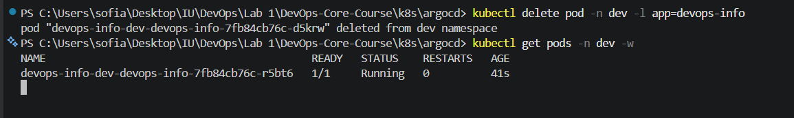

# Lab 13 - GitOps with ArgoCD

## 1) ArgoCD Setup

### Installation

Executed commands in PowerShell:

1. helm repo add argo https://argoproj.github.io/argo-helm
2. helm repo update
3. kubectl create namespace argocd
4. helm install argocd argo/argo-cd --namespace argocd
5. kubectl get pods -n argocd

Verification:

- UI is accessible via local port-forward.

### UI Access

1. kubectl port-forward svc/argocd-server -n argocd 8080:443
2. Open https://localhost:8080
3. Username: admin
4. Retrieve password in PowerShell:
   $enc = kubectl -n argocd get secret argocd-initial-admin-secret -o jsonpath="{.data.password}"
   [System.Text.Encoding]::UTF8.GetString([System.Convert]::FromBase64String($enc))

### CLI Configuration

Install CLI (Windows):

1. winget install --id ArgoProject.ArgoCD --exact
2. argocd version --client
3. argocd login localhost:8080 --insecure

## 2) Application Configuration

Created manifests:

- k8s/argocd/application.yaml
- k8s/argocd/application-dev.yaml
- k8s/argocd/application-prod.yaml

Source configuration:

- repoURL: https://github.com/angel-palkina/DevOps-Core-Course.git
- targetRevision: feature/lab13
- path: k8s/devops-info

Values selection:

- default app uses values.yaml
- dev app uses values-dev.yaml
- prod app uses values-prod.yaml

Applied NodePorts:

- default app: 30090
- dev app: 30091
- prod app: 30092

Apply manifests:

1. kubectl apply -f k8s/argocd/application.yaml
2. kubectl apply -f k8s/argocd/application-dev.yaml
3. kubectl apply -f k8s/argocd/application-prod.yaml

## 3) Multi-Environment

### Namespace Separation

1. kubectl create namespace dev
2. kubectl create namespace prod

### Dev vs Prod

- dev namespace: auto-sync enabled with prune=true and selfHeal=true
- prod namespace: manual sync only (no automated block)

Why prod is manual:

- safer controlled releases
- possibility to review changes before deployment
- lower risk during production windows

Verification commands:

1. argocd app list
2. kubectl get pods -n dev
3. kubectl get pods -n prod

Verified state:

- devops-info: Sync Status = Synced to feature/lab13 (97862c3), Health = Healthy
- devops-info-dev: Sync Status = Synced to feature/lab13 (97862c3), Health = Healthy
- devops-info-prod: Sync Status = Synced to feature/lab13 (97862c3), Health = Healthy

## 4) Self-Healing Evidence

### Test A - Manual Scale Drift (dev)

1. kubectl scale deployment devops-info-dev-devops-info -n dev --replicas=5
2. kubectl get deploy -n dev -w
3. argocd app get devops-info-dev

Observed timestamps:

- Before scale: 2026-04-22 23:11:38 +0300 MSK
- Drift detected: 2026-04-22 23:11:38 +0300 MSK
- Reconciled to Git state: 2026-04-22 23:11:56 +0300 MSK

### Test B - Pod Deletion

1. kubectl delete pod -n dev -l app=devops-info
2. kubectl get pods -n dev -w

- Kubernetes recreates deleted pod through Deployment/ReplicaSet controller.

### Test C - Manual Resource Edit

1. kubectl set image deployment/devops-info-dev-devops-info devops-info=spalkkina/devops-info-service:manual-test -n dev
2. Verify the live deployment image changed from `latest` to `manual-test`
3. Run `argocd app diff devops-info-dev --refresh`
4. Observe ArgoCD return the deployment to the Git-defined image after self-heal

Expected result:

- ArgoCD returns resource to declarative state from Git.

Actual result:

- The temporary image change was reverted back to `spalkkina/devops-info-service:latest`.
- `argocd app get devops-info-dev --refresh` showed `Synced` and `Healthy` after reconciliation.
- `argocd app diff devops-info-dev --refresh` produced no output after reconciliation, which indicates the live state matches the Git desired state.

## 5) Sync Behavior Notes

- Kubernetes self-healing: keeps desired pod count and replaces failed/deleted pods.
- ArgoCD self-healing: reverts cluster configuration drift to Git desired state.
- ArgoCD reconciliation interval is about 3 minutes by default, unless sync is manual or triggered by webhook/CLI/UI.