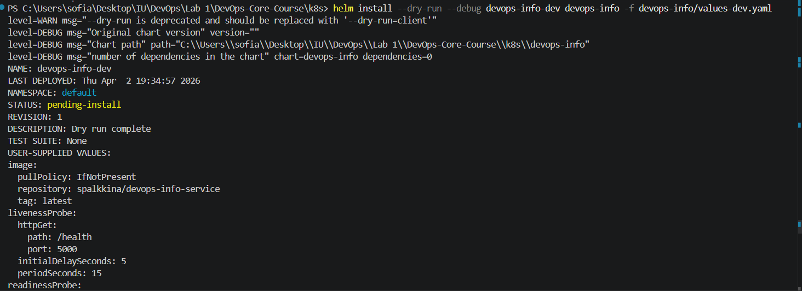

# DevOps Info Helm Chart — Documentation (Lab 10)

## 1. Chart Overview

**Chart Name:** `devops-info`  
**Purpose:** Package and deploy the `devops-info-service` app as a reusable, configurable Helm chart for Kubernetes.

### Chart Structure

```
devops-info/
├── Chart.yaml
├── values.yaml
├── values-dev.yaml
├── values-prod.yaml
└── templates/
    ├── deployment.yaml
    ├── service.yaml
    ├── _helpers.tpl
    └── hooks/
        ├── pre-install-job.yaml
        └── post-install-job.yaml
```

- **Chart.yaml:** Chart metadata (name, version, description, maintainers, etc.)
- **values.yaml:** Default configuration values
- **values-dev.yaml / values-prod.yaml:** Environment-specific overrides
- **templates/:**
    - `deployment.yaml` — Deployment manifest, fully templated
    - `service.yaml` — Service manifest, fully templated
    - `_helpers.tpl` — Helper templates (labels, fullname, etc.)
    - `hooks/` — Chart lifecycle jobs (pre-install, post-install)

### Values Organization

All configurable values (image, resources, probes, labels, etc.) are in `values.yaml`.  
Environment-specific settings (replica count, image tag, ports, resources) are overridden in `values-dev.yaml` and `values-prod.yaml`.

---

## 2. Configuration Guide

### Important Values (`values.yaml`)

```yaml
replicaCount: 3

image:
  repository: spalkkina/devops-info-service
  tag: "1.0"
  pullPolicy: IfNotPresent

service:
  type: NodePort
  port: 80
  targetPort: 5000
  nodePort: 30080

resources:
  limits:
    cpu: 400m
    memory: 256Mi
  requests:
    cpu: 100m
    memory: 128Mi

livenessProbe:
  httpGet:
    path: /health
    port: 5000
  initialDelaySeconds: 10
  periodSeconds: 5
  timeoutSeconds: 2
  failureThreshold: 3

readinessProbe:
  httpGet:
    path: /health
    port: 5000
  initialDelaySeconds: 5
  periodSeconds: 3
  timeoutSeconds: 2
  failureThreshold: 3
```

#### Environment Overrides

**values-dev.yaml**
```yaml
replicaCount: 1
image:
  tag: "latest"
service:
  nodePort: 30081
resources:
  limits:
    cpu: 100m
    memory: 128Mi
  requests:
    cpu: 50m
    memory: 64Mi
livenessProbe:
  initialDelaySeconds: 5
  periodSeconds: 15
readinessProbe:
  initialDelaySeconds: 5
  periodSeconds: 10
```

**values-prod.yaml**
```yaml
replicaCount: 5
image:
  tag: "1.0"
service:
  nodePort: 30082
resources:
  limits:
    cpu: 500m
    memory: 512Mi
  requests:
    cpu: 200m
    memory: 256Mi
livenessProbe:
  initialDelaySeconds: 30
  periodSeconds: 5
readinessProbe:
  initialDelaySeconds: 10
  periodSeconds: 3
```

### Customizing & Installing

**Install "dev" environment:**
```sh
helm install devops-info-dev devops-info -f devops-info/values-dev.yaml
```

**Install "prod" environment:**
```sh
helm install devops-info-prod devops-info -f devops-info/values-prod.yaml
```

**Override any value at runtime:**
```sh
helm install test devops-info --set replicaCount=10
```

---

## 3. Hook Implementation

### What Hooks Are Used

- **pre-install:** Runs a migration/validation job before Deployment and Service creation
- **post-install:** Runs a "smoke test" job after installation

### Example Hook Template

```yaml
apiVersion: batch/v1
kind: Job
metadata:
  name: "{{ include "devops-info.fullname" . }}-pre-install"
  annotations:
    "helm.sh/hook": pre-install
    "helm.sh/hook-weight": "-5"
    "helm.sh/hook-delete-policy": hook-succeeded
spec:
  template:
    spec:
      restartPolicy: Never
      containers:
        - name: pre-install-job
          image: busybox
          command: ['sh', '-c', 'echo Pre-install running && sleep 10 && echo Done!']
```

- **Hook weights:** Pre-install = -5 (runs before resources), Post-install = 5 (runs after)
- **Deletion policies:** `hook-succeeded` — job is auto-deleted if successful
- **Why:** Linting, DB prep, and smoke tests — ensures healthy deploys and easy rollback

---

## 4. Installation Evidence


### Jobs execution and cleanup:
- During install (with sleep in hook), jobs appear in `kubectl get jobs`
- After success, jobs cleaned up automatically


---

## 5. Operations

**Install:**
```sh
helm install <release-name> devops-info -f <values-file>
```
**Upgrade:**
```sh
helm upgrade <release-name> devops-info -f <values-file>
```
**Rollback:**
```sh
helm rollback <release-name> <revision>
```
**Uninstall:**
```sh
helm uninstall <release-name>
```

**Verify Service:**
```sh
kubectl get svc
minikube service <service-name>
```
Then access via NodePort:  
`http://<minikube-ip>:<nodePort>/health`

---

## 6. Testing & Validation

**Helm lint:**
```sh
helm lint devops-info
```

**Render templates:**
```sh
helm template devops-info-dev devops-info -f devops-info/values-dev.yaml
```


**Dry-run install:**
```sh
helm install --dry-run --debug devops-info-dev devops-info -f devops-info/values-dev.yaml
```


**Access app:**


