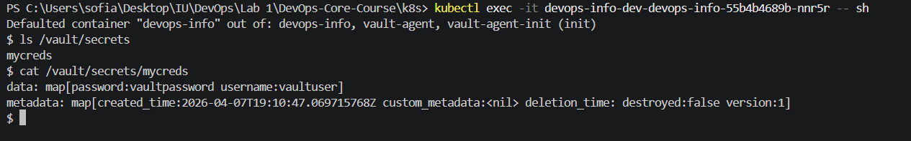

# Secrets Management in Kubernetes and HashiCorp Vault


## 1. Kubernetes Secrets Fundamentals

### Create Secret with `kubectl`

```bash
kubectl create secret generic app-credentials --from-literal=username=devuser --from-literal=password=SuperSecret123
```

###  View Secret in YAML

```bash
kubectl get secret app-credentials -o yaml

[System.Text.Encoding]::UTF8.GetString([System.Convert]::FromBase64String("ZGV2dXNlcg=="))
[System.Text.Encoding]::UTF8.GetString([System.Convert]::FromBase64String("U3VwZXJTZWNyZXQxMjM="))
```


### Base64 Encoding vs Encryption

- Kubernetes Secret values are **base64-encoded**, not encrypted.
- Base64 only transforms representation; it does not protect confidentiality.
- Anyone with sufficient API access can retrieve and decode secret values.

###  Are Kubernetes Secrets encrypted at rest by default?

**No.** By default, Kubernetes Secrets are not encrypted at rest in etcd unless encryption at rest is explicitly enabled in cluster configuration.

### What is etcd encryption and when to enable it?

etcd encryption at rest encrypts sensitive API objects (including Secrets) before storing them in etcd.  
It should be enabled in all production clusters to reduce risk from disk snapshots, backups, and direct datastore access.


## 2. Helm-Managed Secrets Integration

### Secret template added to Helm chart

File created: `templates/secrets.yaml`

```yaml
apiVersion: v1
kind: Secret
metadata:
  name: {{ include "devops-info.fullname" . }}-secret
  labels:
    {{- include "devops-info.labels" . | nindent 4 }}
type: Opaque
stringData:
  username: {{ .Values.secrets.username | quote }}
  password: {{ .Values.secrets.password | quote }}
```

### Secret values in `values.yaml`

```yaml
secrets:
  username: "changeme"
  password: "changeme"
```

> Note: Placeholder values are committed to Git. Real secrets must be provided at deploy time.

###  Deployment consumes Secret

In `deployment.yaml`, environment values are injected from Secret:

```yaml
envFrom:
  - secretRef:
      name: {{ include "devops-info.fullname" . }}-secret
```

### Verification

Deployment command:

```bash
helm upgrade --install devops-info-dev devops-info -f devops-info/values-dev.yaml
```


Pod check:

```bash
kubectl get pods
kubectl exec -it <pod-name> -- sh
env 
```


### Secret visibility in `kubectl describe pod`


## 3. Resource Management

### Deployment resources configuration

The chart uses values-driven resources in `deployment.yaml`:

```yaml
resources:
  {{- toYaml .Values.resources | nindent 12 }}
```

And configured in values files

### Requests vs Limits

- **requests**: guaranteed minimum resources for scheduling
- **limits**: maximum resources a container can consume

### How to choose values

- Start from observed app usage in development/testing.
- Set requests near baseline steady usage.
- Set limits high enough for spikes but low enough to prevent noisy-neighbor issues.
- Re-tune with metrics (Prometheus/Grafana, HPA/VPA signals) over time.


## 4. HashiCorp Vault Integration

###  Vault installation (Helm)

```bash
helm repo add hashicorp https://helm.releases.hashicorp.com
helm repo update
helm install vault hashicorp/vault --set server.dev.enabled=true --set injector.enabled=true
```

Verification:

```bash
kubectl get pods
```


### Vault secret engine and secret creation

Inside `vault-0` pod:

```bash
vault secrets enable -path=secret kv-v2
vault kv put secret/devops-info username="vaultuser" password="vaultpassword"
vault kv get secret/devops-info
```

### Kubernetes auth configuration in Vault

```bash
vault auth enable kubernetes
vault write auth/kubernetes/config \
  kubernetes_host="https://kubernetes.default.svc:443" \
  kubernetes_ca_cert=@/var/run/secrets/kubernetes.io/serviceaccount/ca.crt \
  disable_iss_validation=true
```

### Policy and role

Policy (`devops-info-policy.hcl`):

```hcl
path "secret/data/devops-info" {
  capabilities = ["read"]
}
```

Apply policy:

```bash
vault policy write devops-info-policy devops-info-policy.hcl
```

Create role:

```bash
vault write auth/kubernetes/role/devops-info-role \
  bound_service_account_names=default \
  bound_service_account_namespaces=default \
  policies=devops-info-policy \
  ttl=24h
```

### Vault Agent injection annotations in Deployment

Added under `.spec.template.metadata.annotations`:

```yaml
vault.hashicorp.com/agent-inject: "true"
vault.hashicorp.com/role: "devops-info-role"
vault.hashicorp.com/agent-inject-secret-mycreds: "secret/data/devops-info"
```

### Injection verification

After redeploy, pod reached `2/2 Running`, confirming injector + sidecar setup is healthy.

Example:

```bash
kubectl get pods

```


Secret file check:

```bash
ls /vault/secrets
cat /vault/secrets/mycreds
```


## Sidecar Injection Pattern Explanation

Vault Agent Injector mutates the pod and adds:

- an init container (`vault-agent-init`) to authenticate and render initial secret files
- a sidecar container (`vault-agent`) to keep templates/secrets updated if needed
- a shared in-memory volume mounted to `/vault/secrets`

Application containers read secrets from files without hardcoding credentials in images or manifests.


## 6. Security Analysis: Kubernetes Secrets vs Vault

## Kubernetes Secrets

**Pros**
- Built-in Kubernetes functionality
- Easy to use with manifests/Helm
- Good for simple setups and low complexity

**Cons**
- Base64 encoding is not encryption
- Requires separate etcd encryption configuration for stronger at-rest protection
- Rotation and audit workflows are more manual

## HashiCorp Vault

**Pros**
- Purpose-built secrets manager
- Strong access policies and identity-based auth
- Better auditability and operational controls
- Dynamic secrets and advanced rotation patterns

**Cons**
- Additional infrastructure and operational complexity
- Requires correct policy/auth configuration
- More moving parts than native K8s Secrets

## 7. Production Recommendations

1. Do not store real credentials in Git or plain Helm values files.
2. Enable etcd encryption at rest for Kubernetes Secrets.
3. Apply strict RBAC for secret access.
4. Use dedicated ServiceAccounts (avoid `default` in production).
5. Use Vault (or equivalent external secret manager) for sensitive production secrets.
6. Implement secret rotation policy and audit access logs.
7. Prefer short-lived credentials and dynamic secrets where possible.
8. Keep Vault HA, backups, and disaster recovery documented and tested.
