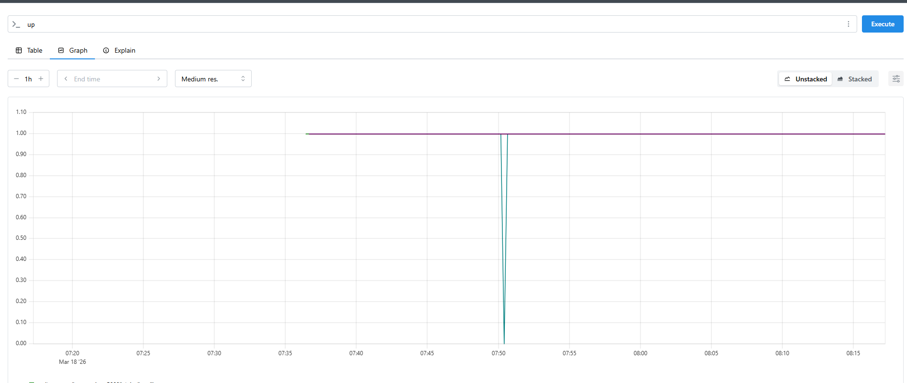
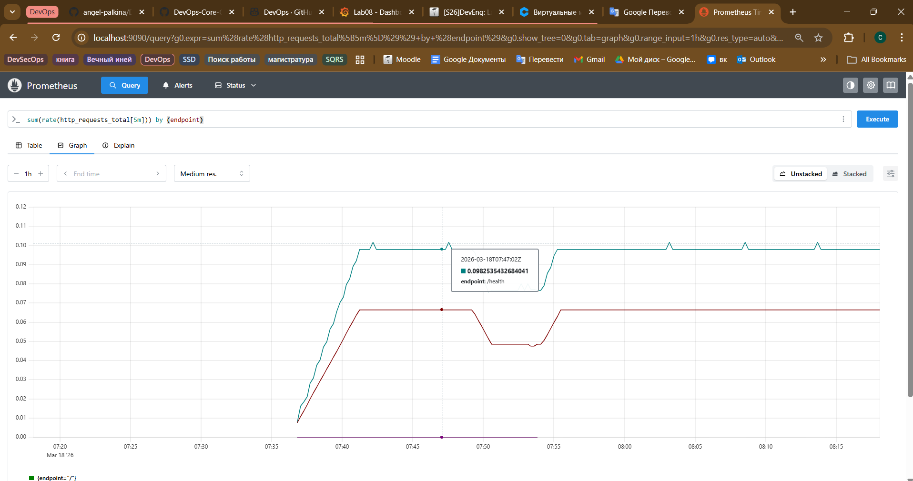
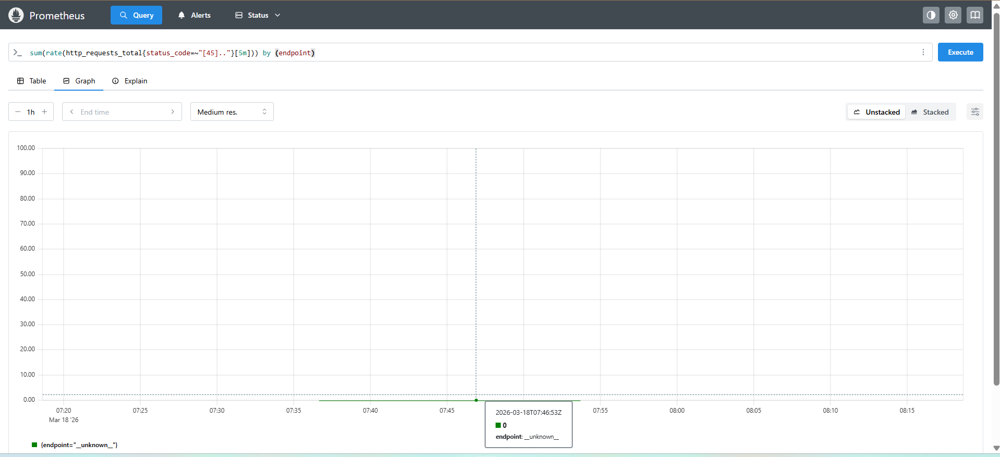
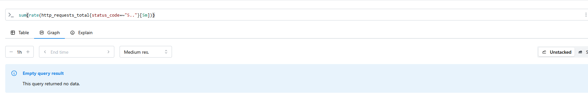
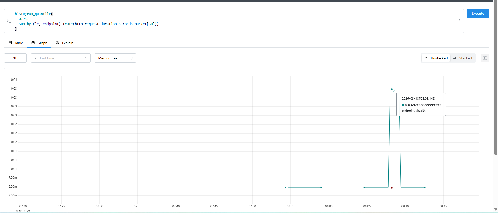
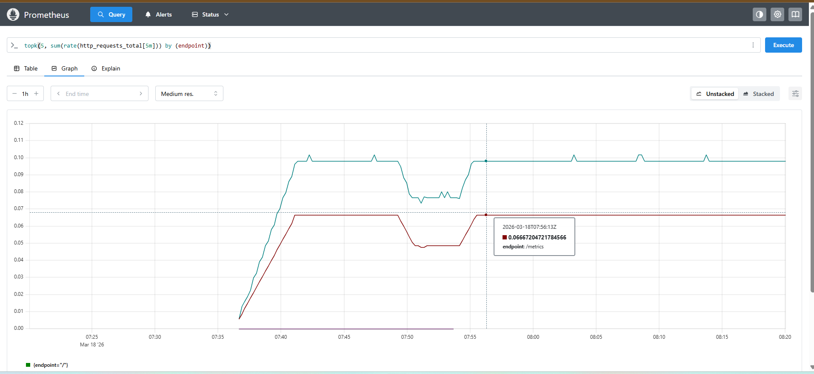
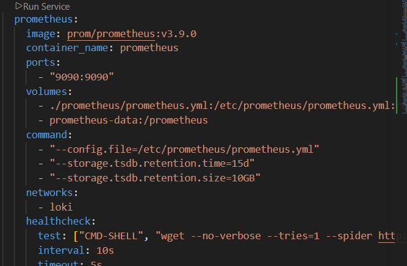
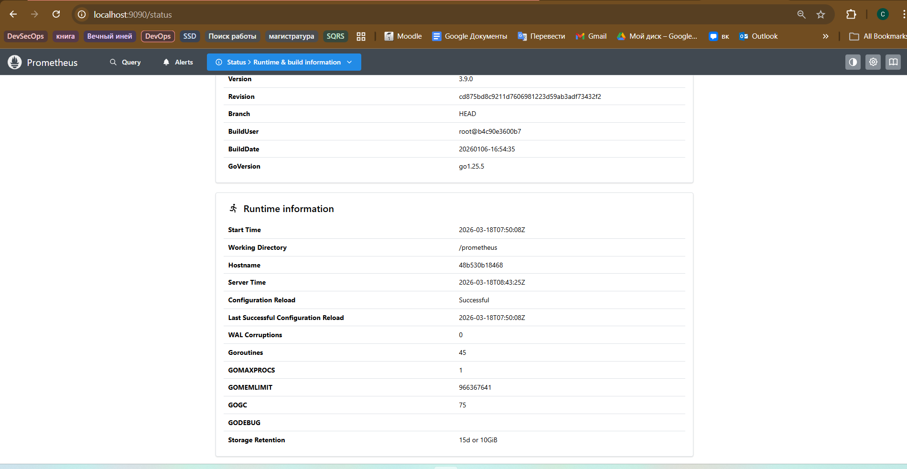

# LAB08 — Prometheus Monitoring & Grafana Dashboards

**Date:** 2026-03-18  
**Student:** Sofa Palkina  


## Architecture

### Metric flow (high-level)

```text
             ┌───────────────────────────────────────────────┐
             │            Flask Application Container         │
             │ Service: app-python (devops-python)            │
             │ Port: 5000                                     │
             │ Exposes:                                       │
             │ - API endpoints: /, /health                    │
             │ - Metrics endpoint: /metrics                   │
             │ Generates metrics (examples):                  │
             │ - http_requests_total{method,endpoint,status}  │
             │ - http_request_duration_seconds{method,endpoint}│
             │ - http_requests_in_progress                    │
             └───────────────────────────────────────────────┘
                          |
                          |  (Prometheus scrape / pull)
                          |  HTTP GET http://app-python:5000/metrics
                          |  every scrape_interval (e.g., 15s)
                          v
             ┌───────────────────────────────────────────────┐
             │               Prometheus Container             │
             │ Service: prometheus                            │
             │ Port: 9090                                     │
             │ Responsibilities:                               │
             │ - Scrape targets (pull metrics)                │
             │ - Store time series in TSDB                    │
             │ - Expose query API (PromQL)                    │
             └───────────────────────────────────────────────┘
                          |
                          |  (Grafana queries Prometheus)
                          |  PromQL over HTTP API:
                          |  http://prometheus:9090
                          v
             ┌───────────────────────────────────────────────┐
             │                Grafana Container               │
             │ Service: grafana                               │
             │ Port: 3000                                     │
             │ Responsibilities:                               │
             │ - Prometheus datasource                        │
             │ - Dashboards (RED: Rate, Errors, Duration)     │
             │ - Visualization and alerting (optional)        │
             └──────────────────────────────────────────────┘
```

**Key idea:**  
- **Prometheus** pulls metrics from `/metrics` periodically (scrape).  
- **Grafana** visualizes metrics from Prometheus using PromQL.

---

## Application Instrumentation

### What was added

The Flask application was instrumented with the Python library:

- `prometheus-client==0.23.1`

A new endpoint was added:

- `GET /metrics` — exposes application metrics in Prometheus text format.

    

### Why these metrics (RED method)

The lab focuses on the **RED method**:

- **R (Rate)**: requests per second
- **E (Errors)**: error rate (4xx/5xx)
- **D (Duration)**: request latency distribution (p95/p99, etc.)

To support RED we added:

- `http_requests_total{method,endpoint,status_code}` (Counter)  
  *Why:* measure total request volume and error rates by status codes.
- `http_request_duration_seconds{method,endpoint}` (Histogram)  
  *Why:* enable percentiles (p95/p99) and latency tracking.
- `http_requests_in_progress` (Gauge)  
  *Why:* measure concurrency / active in-flight requests.

App-specific:
- `devops_info_endpoint_calls_total{endpoint}` (Counter)  
  *Why:* quick per-endpoint call counts (simpler than filtering `http_requests_total`).
- `devops_info_system_collection_seconds` (Histogram)  
  *Why:* detect slow system info collection in `/` endpoint.

### Code evidence (metric definitions & middleware)

```python
# ========== Prometheus Metrics ==========
HTTP_REQUESTS_TOTAL = Counter(
    "http_requests_total",
    "Total HTTP requests",
    ["method", "endpoint", "status_code"]
)

HTTP_REQUEST_DURATION_SECONDS = Histogram(
    "http_request_duration_seconds",
    "HTTP request duration in seconds",
    ["method", "endpoint"]
)

HTTP_REQUESTS_IN_PROGRESS = Gauge(
    "http_requests_in_progress",
    "HTTP requests currently being processed"
)

ENDPOINT_CALLS = Counter(
    "devops_info_endpoint_calls_total",
    "DevOps info service endpoint calls",
    ["endpoint"]
)

SYSTEM_INFO_DURATION_SECONDS = Histogram(
    "devops_info_system_collection_seconds",
    "Time spent collecting system info"
)
```

Middleware (request/response hooks) updates the metrics on every HTTP request.

### Endpoint label normalization (cardinality control)

Problem: calling many unique unknown URLs (e.g. `/notfound1`, `/notfound2`, …) creates many unique time series in Prometheus (**high cardinality**), which:
- makes dashboards noisy
- increases memory usage
- increases storage usage

Solution: normalize unknown paths into a single label value:

- known endpoints: `/`, `/health`, `/metrics`
- everything else: `endpoint="__unknown__"`

This ensures only a limited set of endpoint label values.

---

## Prometheus Configuration

```yml
global:
  scrape_interval: 15s
  evaluation_interval: 15s

scrape_configs:
  - job_name: "prometheus"
    static_configs:
      - targets: ["localhost:9090"]

  - job_name: "app"
    metrics_path: /metrics
    static_configs:
      - targets: ["app-python:5000"]

  - job_name: "loki"
    metrics_path: /metrics
    static_configs:
      - targets: ["loki:3100"]

  - job_name: "grafana"
    metrics_path: /metrics
    static_configs:
      - targets: ["grafana:3000"]
```

### Scrape targets and intervals

- **Scrape interval:** `15s`
- **Metrics path:** `/metrics` (explicit for the app)

### Retention policy

Prometheus was started with retention limits:

- Time: `15d`
- Size: `10GB`

This prevents unlimited TSDB growth.


## Dashboard Walkthrough (Custom Dashboard)


### Panel 1 — Request Rate (RPS) by endpoint
**Purpose:** show traffic volume per endpoint.

```promql
sum(rate(http_requests_total[5m])) by (endpoint)
```

### Panel 2  — App uptime (target UP)
**Purpose:** check if monitoring sees the app as healthy.

```promql
up{job="app"}
```

### Panel 3 — 5xx Error rate (server errors)
**Purpose:** track server-side failures.  
**Note:** if there are no 5xx, Grafana may show *No data* (expected).

```promql
sum(rate(http_requests_total{status_code=~"5.."}[5m])) by (endpoint)
```

### Panel 4 — p95 latency by endpoint
**Purpose:** track tail latency (user experience).

```promql
histogram_quantile(
  0.95,
  sum by (le, endpoint) (rate(http_request_duration_seconds_bucket[5m]))
)
```

### Panel 5 — Active requests (in-flight)
**Purpose:** detect spikes in concurrency and saturation.

```promql
http_requests_in_progress
```

### Panel 6 — Status code distribution (Pie Chart)
**Purpose:** see proportion of status codes in recent window.  
**Tip:** Pie charts work best with `increase()` to get a single aggregated value per label.

```promql
sum by (status_code) (increase(http_requests_total[5m]))
```


---

## PromQL Examples 

1) **Check that all targets are being scraped**
```promql
up
```

**Explanation:** returns `1` when target is reachable and scraped successfully.

2) **Request rate (RED: Rate)**
```promql
sum(rate(http_requests_total[5m])) by (endpoint)
```

**Explanation:** average requests/sec in last 5 minutes, grouped by endpoint.

3) **Error rate (RED: Errors)**
```promql
sum(rate(http_requests_total{status_code=~"[45].."}[5m])) by (endpoint)
```

**Explanation:** errors/sec (both client and server errors) per endpoint.

4) **5xx-only errors**
```promql
sum(rate(http_requests_total{status_code=~"5.."}[5m]))
```

**Explanation:** server failures/sec; may be empty if no 5xx occurred.

5) **Latency p95 (RED: Duration)**
```promql
histogram_quantile(
  0.95,
  sum by (le, endpoint) (rate(http_request_duration_seconds_bucket[5m]))
)
```

**Explanation:** p95 latency per endpoint from histogram buckets.

6) **Top endpoints by traffic**
```promql
topk(5, sum(rate(http_requests_total[5m])) by (endpoint))
```

**Explanation:** shows the 5 busiest endpoints.

---

## Production Setup

### Health checks

All core services are expected to have health checks:
- app-python: healthy
- grafana: healthy
- loki: healthy
- prometheus: healthy


### Resource limits

Resource limits were configured in `docker-compose.yml` (CPU and memory) to prevent one service from consuming all host resources.

**Recommended limits:**
- App: ~256MB / 0.5 CPU
- Grafana: ~512MB / 0.5 CPU
- Loki: ~1GB / 1 CPU
- Prometheus: ~1GB / 1 CPU
- Promtail: ~256MB / 0.5 CPU

### Retention policies

- **Prometheus retention:** `15d` and `10GB` (flags passed via container command)
- **Loki retention:** configured in Loki config (from Lab 7) (document retention there too)




### Persistence proof after restart


---

## Comparison: Metrics vs Logs (Lab 7)

**Metrics (Prometheus):**
- numeric time series
- fast aggregation (rates, percentiles, SLO dashboards)
- best for: alerting, trend analysis, capacity, RED/USE methods
- example: “RPS increased”, “p95 latency is too high”, “error rate > 1%”

**Logs (Loki, Lab 7):**
- discrete event records (structured JSON)
- rich context per event (request path, client IP, stack traces)
- best for: debugging individual incidents, root cause analysis, audits
- example: “Why did this particular request fail?”, “What exception happened?”

**Practical workflow:**
1. Metrics detect **what** is wrong (spike in 5xx / latency).
2. Logs explain **why** (specific error messages, stack trace, context).


## Challenges & Solutions

**Pie chart didn’t split by codes**
- **Issue:** grouping used the wrong label (`status` instead of `status_code`) and rate was not ideal for pie.
- **Fix:** use:
  ```promql
  sum by (status_code) (increase(http_requests_total[5m]))
  ```

