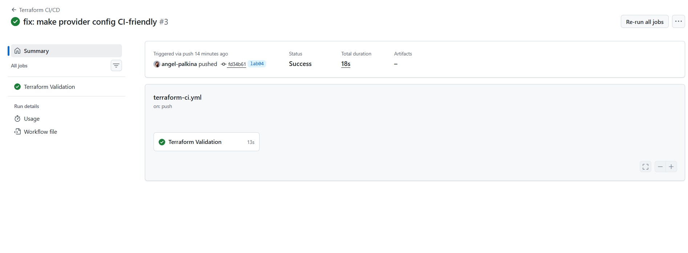
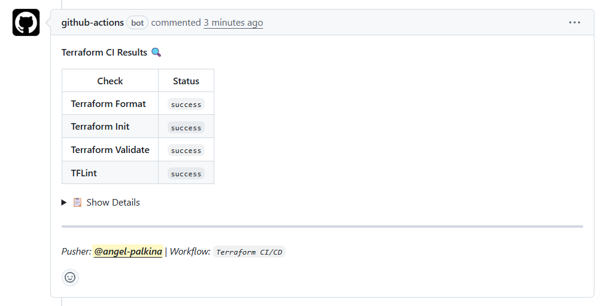

# Lab 04 Bonus: IaC CI/CD Pipeline

**Author:** Angel Palkina  
**Date:** 2026-02-19  
**Course:** DevOps Core Course  


## 🛠️ Tools & Technologies

| Tool | Version | Purpose |
|------|---------|---------|
| **GitHub Actions** | - | CI/CD automation platform |
| **Terraform** | 1.10.x | Infrastructure as Code |
| **TFLint** | 0.61.0 | Terraform linter |
| **tfsec** | 1.0.3 | Security scanner for Terraform |
| **github-script** | v7 | PR automation |

---

##  Workflow Implementation

### File Structure

```
.github/workflows/
├── python-ci.yml       # Python application CI (improved with path filters)
└── terraform-ci.yml    # NEW: Terraform validation workflow
```


##  Path Filter Configuration

### Problem Statement

**Before:** All workflows triggered on any file change
- Python CI ran on Terraform changes 
- Wasted GitHub Actions minutes
- Confusing workflow results

**After:** Workflows trigger only on relevant files
- Python CI → `app_python/**` only
- Terraform CI → `terraform/**` only
- Efficient resource usage


##  TFLint Configuration & Results

### Local Testing Results

**Commands executed:**

```bash
cd terraform

# Format check
terraform fmt -check -recursive
#  No output = all files formatted correctly

# Initialize
terraform init -backend=false
#  Success

# Validate
terraform validate
#  Success! The configuration is valid.

# TFLint
tflint --init
#  Installing plugins...

tflint --recursive
#  No issues found!
```

**All checks passed locally before pushing to CI! **


## Workflow Execution Examples

### Example 1: Successful Validation (Push to branch)



### Example 2: Pull Request with Comments

**Trigger:** Create PR from `lab04-bonus` to `lab04`



### Example 3: Format Error Detection

**Scenario:** Intentionally break formatting

**Workflow Result:**

```
✓ Terraform Format Check                  (⚠️ warning)
  Error: main.tf needs formatting
  
✓ Terraform Init                          (✅ success)
✓ Terraform Validate                      (✅ success)
✓ Run TFLint                              (✅ success)
⚠️ Warning if format or lint fails
  Format status: failure
  Please fix these issues, but workflow will not fail.
```

**PR Comment:**

```markdown
| **Terraform Format** | `failure` |

❌ Some files need formatting. Run: `terraform fmt -recursive`
```

**Workflow:** Completes with warning (doesn't fail) 


## 📚 References & Resources

**Documentation:**
- [GitHub Actions Documentation](https://docs.github.com/en/actions)
