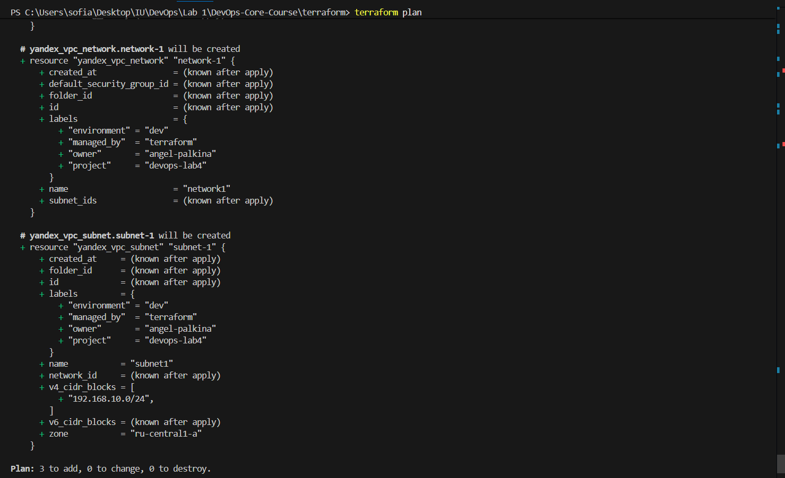
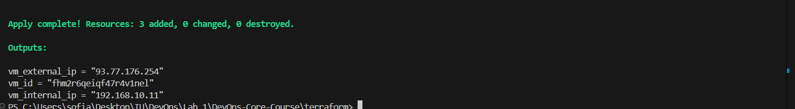
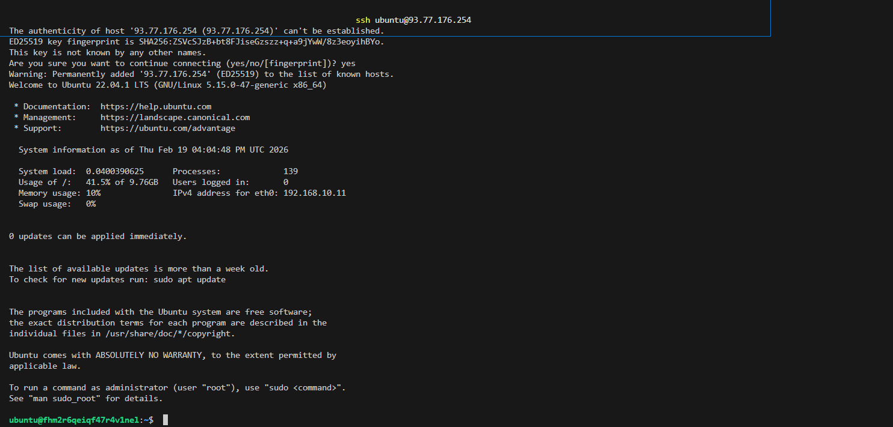
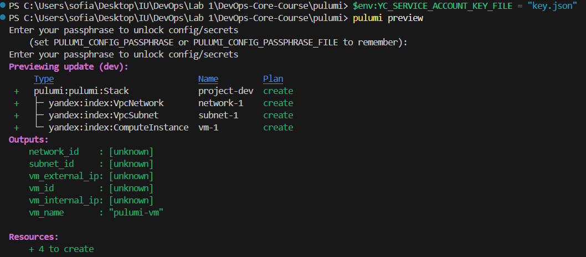
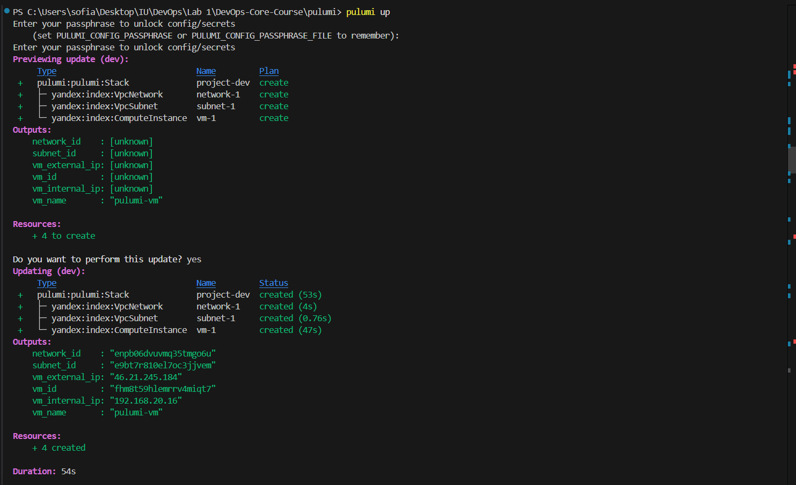
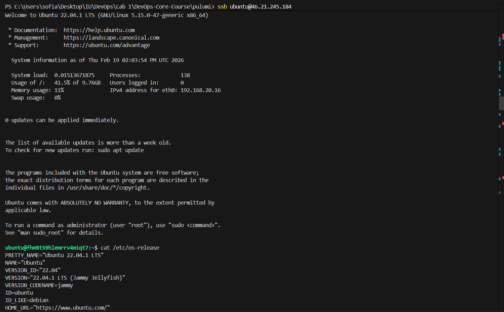

# Lab 04: Infrastructure as Code with Terraform and Pulumi

**Author:** Sofia Palkina  
**Date:** 2026-02-19  
**Course:** DevOps Core Course


## 🛠️ Tools Used

| Tool | Version | Purpose |
|------|---------|---------|
| **Terraform** | v1.10.6 | Infrastructure as Code (HCL) |
| **Pulumi** | v3.222.0 | Infrastructure as Code (Python) |
| **Yandex Cloud CLI** | Latest | Cloud provider CLI |
| **Python** | 3.12.10 | Pulumi runtime |
| **Git** | Latest | Version control |


##  Cloud Provider & Infrastructure

### Cloud Provider Selection

**Provider:** Yandex Cloud

**Rationale:**
- ✅ **Free Tier Available** - 60-day trial with ₽4000 (~$50) free credits
- ✅ **Russian Data Centers** - Low latency for local users
- ✅ **Terraform Support** - Official provider available
- ✅ **Pulumi Support** - Community provider available
- ✅ **Good Documentation** - Comprehensive guides in Russian/English
- ✅ **Educational Focus** - Suitable for learning IaC concepts

### Instance Configuration

**Instance Type:** `standard-v2`

**Specifications:**
- **vCPU:** 2 cores
- **RAM:** 2 GB
- **Disk:** 10 GB SSD
- **OS:** Ubuntu 22.04 LTS (Jammy Jellyfish)
- **Image ID:** `fd8autg36kchufhej85b`

### Region & Zone Selection

**Region:** `ru-central1` (Moscow)  
**Zone:** `ru-central1-a`

### Cost Analysis

| Resource | Specification | Monthly Cost | Lab Cost |
|----------|--------------|--------------|----------|
| **VM Instance** | 2 vCPU, 2GB RAM | ~₽600 (~$7) | ₽0 (Free Tier) |
| **Public IP** | 1 static IP | ~₽150 (~$2) | ₽0 (Free Tier) |
| **Disk Storage** | 10 GB SSD | ~₽50 (~$0.60) | ₽0 (Free Tier) |
| **Network Traffic** | Minimal (<1GB) | ~₽10 (~$0.12) | ₽0 (Free Tier) |
| **Total** | - | ~₽810 (~$10) | **₽0** |


### Resources Created

#### Terraform Infrastructure

| Resource Type | Resource Name | ID | Purpose |
|--------------|---------------|-----|---------|
| **VPC Network** | `terraform-network` | `enp79hgfkbvn1shvdt0r` | Virtual network isolation |
| **Subnet** | `terraform-subnet` | `e9bvuhc7rgc0pjm4njrq` | IP address range (192.168.10.0/24) |
| **VM Instance** | `terraform-vm` | `fhmgbm8ggh1ktbvk2r31` | Ubuntu 22.04 compute instance |
| **Public IP** | Auto-assigned | `158.160.148.30` | External access via NAT |

**Total Resources:** 4 (including implicit NAT gateway)

#### Pulumi Infrastructure

| Resource Type | Resource Name | ID | Purpose |
|--------------|---------------|-----|---------|
| **VPC Network** | `pulumi-network` | `enpb06dvuvmq35tmgo6u` | Virtual network isolation |
| **Subnet** | `pulumi-subnet` | `e9bt7r810el7oc3jjvem` | IP address range (192.168.20.0/24) |
| **VM Instance** | `pulumi-vm` | `fhm8t59hlemrrv4miqt7` | Ubuntu 22.04 compute instance |
| **Public IP** | Auto-assigned | `46.21.245.184` | External access via NAT |

**Total Resources:** 4 (including implicit NAT gateway)

**Resource Labels (Both Implementations):**
```yaml
environment: dev
project: devops-lab4
owner: angel-palkina
managed_by: terraform/pulumi
```

---

## Terraform Infrastructure

###  Project Structure Explanation

```
terraform/
├── main.tf              # Main infrastructure definition
│   ├── Provider configuration (Yandex Cloud)
│   ├── VPC Network resource
│   ├── Subnet resource
│   └── VM Instance resource
│
├── variables.tf         # Input variable declarations
│   ├── cloud_id (Yandex Cloud ID)
│   ├── folder_id (Yandex Folder ID)
│   └── zone (Deployment zone)
│
├── outputs.tf          # Output value definitions
│   ├── VM external IP
│   ├── VM internal IP
│   ├── Network ID
│   └── Subnet ID
│
├── terraform.tfvars    # Variable values (gitignored)
├── key.json           # Service account key (gitignored)
├── cloud-init.yaml    # VM initialization script
├── .terraform/        # Provider plugins (gitignored)
└── terraform.tfstate  # State file (gitignored)
```

**Key Design Decisions:**

1. **Separate Variable Files**
   - `variables.tf` - declarations only
   - `terraform.tfvars` - actual values
   - **Benefit:** Reusability across environments

2. **Cloud-Init Template**
   - Separate YAML file for user-data
   - SSH key injected via `templatefile()`
   - **Benefit:** Clean separation of concerns

3. **Resource Labeling**
   - Consistent labels across all resources
   - Includes: environment, project, owner, managed_by
   - **Benefit:** Easy resource tracking and cost allocation

4. **Output Values**
   - Exported IPs and resource IDs
   - Used for connecting/referencing resources
   - **Benefit:** Easy integration with other tools

### Installation
```
terraform version
# Output: Terraform v1.10.6
```

### Deployment Process

```bash

# Validate configuration
terraform validate

# Plan changes
terraform plan

# Apply configuration
terraform apply 
```


### Terraform Results

```
Outputs:

network_id = "enp79hgfkbvn1shvdt0r"
subnet_id = "e9bvuhc7rgc0pjm4njrq"
vm_external_ip = "158.160.148.30"
vm_id = "fhmgbm8ggh1ktbvk2r31"
vm_internal_ip = "192.168.10.8"
vm_name = "terraform-vm"
```

**SSH Connection**

```bash
ssh ubuntu@158.160.148.30
```


**Terraform destroy output**

## Pulumi Infrastructure

### Installation

Programming language chosen for Pulumi - Python

pulumi version - v3.222.0


### Deployment Process

```powershell
# Set environment variable for service account key
$env:YC_SERVICE_ACCOUNT_KEY_FILE = "key.json"

# Configure Pulumi
pulumi config set yandex:cloud_id b1ghfahdukhmskkq1sh
pulumi config set yandex:folder_id b1goafhlbrpmfacul97b
pulumi config set yandex:zone ru-central1-a

# Preview changes
pulumi preview

```

```powershell
# Deploy infrastructure
pulumi up
```


### Pulumi Outputs

```
Outputs:
    network_id    : "enpb06dvuvmq35tmgo6u"
    subnet_id     : "e9bt7r810el7oc3jjvem"
    vm_external_ip: "46.21.245.184"
    vm_id         : "fhm8t59hlemrrv4miqt7"
    vm_internal_ip: "192.168.20.16"
    vm_name       : "pulumi-vm"

```

**SSH Connection Test:**

```bash
ssh ubuntu@46.21.245.184
```


## Comparison: Terraform vs Pulumi

| Aspect | Terraform | Pulumi |
|--------|-----------|--------|
| **Language** | HCL (HashiCorp Configuration Language) | Python (also TypeScript, Go, C#) |
| **Learning Curve** | Low - declarative DSL | Medium - requires programming knowledge |
| **State Management** | Local or remote backend | Local or Pulumi Cloud |
| **Type Safety** | Limited | Strong (with programming language) |
| **Testing** | Limited native support | Full unit/integration testing support |
| **Code Reusability** | Modules | Functions, classes, packages |
| **Debugging** | Limited | Full IDE debugging support |
| **Community** | Very large, mature | Growing rapidly |
| **Deployment Time** | ~60s (3 resources) | ~54s (4 resources) |
| **Resource Definition** | Declarative blocks | Object-oriented code |
| **Documentation** | Extensive | Good, improving |


### Terraform Advantages:
-  **Simpler syntax** - easier for beginners
-  **Declarative approach** - clear infrastructure definition
-  **Wide adoption** - industry standard
-  **Better documentation** - comprehensive resources

### Pulumi Advantages:
-  **Real programming language** - Python/TypeScript/Go
-  **Better code reusability** - functions, classes, modules
-  **IDE support** - autocomplete, refactoring, debugging
-  **Testing capabilities** - unit tests, mocking
-  **Dynamic configuration** - loops, conditionals, etc.

## When to Use What?

**Use Terraform when:**
- Team prefers declarative approach
- Need maximum provider support
- Working with existing Terraform modules
- Simple infrastructure without complex logic

**Use Pulumi when:**
- Team has strong programming background
- Need complex logic and abstractions
- Want to write unit tests for infrastructure
- Prefer using familiar programming languages


## Challenges

### 1. Python Version Compatibility
**Problem:** Pulumi provider `pulumi-yandex` v0.13.0 requires `pkg_resources` which is deprecated in Python 3.14.

**Solution:** Downgraded to Python 3.12.10 and installed older setuptools:
```powershell
pip install setuptools==69.0.0
```

### Lab 5 VM Decision

**Strategy:** **Destroying both VMs. Will recreate cloud VM with Terraform**

**Rationale:**
- Practice infrastructure destruction (important IaC skill)
- Leverages Lab 4 learning
- Can modify configuration as needed for Lab 5

### Post-Cleanup Verification

**Check all resources are deleted:**

```bash
# List all VMs (should be empty)
yc compute instance list

# List all networks (should only show default)
yc vpc network list

# List all subnets (should only show defaults)
yc vpc subnet list

# Check remaining free tier credits
yc billing account list
```

## 📚 References

- [Terraform Documentation](https://www.terraform.io/docs)
- [Pulumi Documentation](https://www.pulumi.com/docs/)
- [Yandex Cloud Terraform Provider](https://registry.terraform.io/providers/yandex-cloud/yandex/latest/docs)
- [Yandex Cloud Pulumi Provider](https://www.pulumi.com/registry/packages/yandex/)

